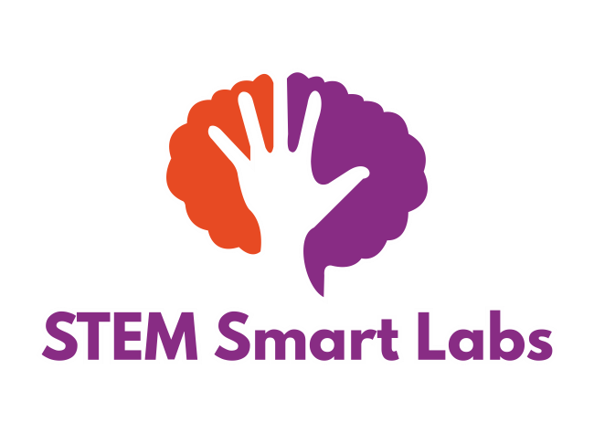

# STEM Smart Labs micro:bit Bluetooth Programmer

Web Bluetooth app for programming BBC micro:bit V2.



## What is included

- Local Universal HEX V2 extraction with no runtime CDN dependency.
- Intel HEX checksum, record-length and physical-flash validation.
- Device-reported MakeCode region validation.
- Live percentage, bytes, address, elapsed time and ETA.
- Packet retry/resynchronisation handling.
- Runtime hash diagnostics.
- Explicit **experimental force programming** flow for runtime mismatches.
- Automated parser tests.
- GitHub Actions deployment to GitHub Pages.

## Important scope

This app uses the micro:bit Programming Service and writes only the MakeCode user-program region. It is not an unrestricted full-firmware DFU tool.

A runtime match is the safe path. If the runtime hashes differ, the app warns the user and permits a forced programming only after explicit acknowledgement. Forced programming does not update the runtime and can result in a non-working program or loss of Bluetooth programming access.

## Local testing

From the repository folder:

```bash
npm test
python3 -m http.server 8000
```

Open:

```text
http://localhost:8000
```

Use a Web Bluetooth-capable browser. Web Bluetooth requires a secure context; `localhost` and GitHub Pages HTTPS satisfy this requirement.
